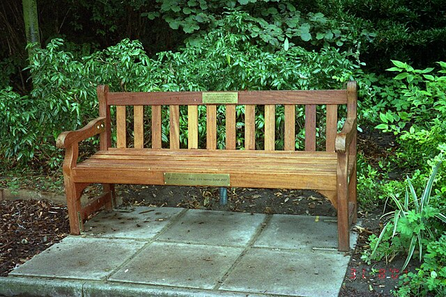

% Pandoc Template for Powerpoint
% Peter Conrad
% 26 November 2019

# Section Title


## How to do a slide

I like to use:

* H1 for section titles
- H2 for slide titles
+ H3 for additional headings in slides

::: notes

Speaker notes go here

:::

## Two-column slide with image


:::::::::::::: {.columns}
::: {.column width="50%"}
Left column:

- Bullet
- Bullet
- Bullet
- 
:::
::: {.column width="50%"}

:::
::::::::::::::

::: notes

Speaker notes go here

:::

## Google Image link

{width=25%}

::: notes

Speaker notes go here

:::

## Table

| Heading | Heading | Heading | Heading | Heading |
| --- | --- | --- | --- | --- |
| Cell | Cell | Cell | Cell | Cell |
| Cell | Cell | Cell | Cell | Cell |
| Cell | Cell | Cell | Cell | Cell |
| Cell | Cell | Cell | Cell | Cell |
| Cell | Cell | Cell | Cell | Cell |

::: notes

Speaker notes go here

:::

## An image

{width=25%}

::: notes

Speaker notes go here

:::

## Bullet lists

- Bullets work
  -  Indenting works

## Ordered lists

1. Ordered lists work
   1. Sub-lists in ordered lists 
1. Next item

::: notes

Speaker notes go here

:::

## Code

JavaScript:

```javascript
var s = "JavaScript syntax highlighting";
alert(s);
```
 
Python:

```python
s = "Python syntax highlighting"
print s
```

Something else:
 
```
No language indicated, so no syntax highlighting. 
But let's throw in a <b>tag</b>.
```
::: notes

Speaker notes go here

:::

## Blockquotes

Blockquotes look like this.

> Here is a blockquote


::: notes

Speaker notes go here

:::


# Thank you